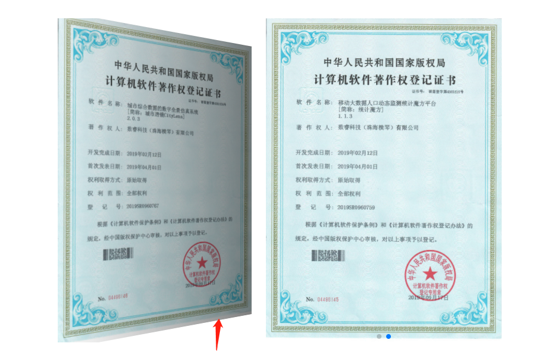
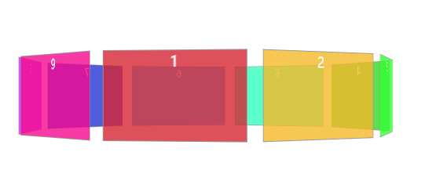
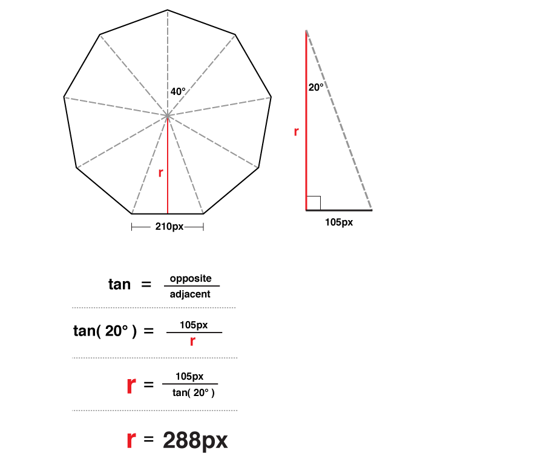

## transform示例

### transform 属性

[transform 属性](https://wiki.dm-ai.cn/display/~caizeping/transform)

[示例](./transform.html)

### 示例

题目：

思路:

1. 左边的图片透视，绕Y轴旋转一定角度

2. 将右边的图片往右移动

3. 左边的图片添加一层遮罩，使用渐变背景（background: linear-gradient）让阴影从右到左有个渐变的效果

4. [代码](./carousel.html)

   

### 3D轮播

思路：

1. 创建轮播图
2. 设置图片视角
3. 移动图片：9张图片，移动角度40°，再让每张图向z轴移动
4. 添加旋转动画
5. [代码](./3D-carousel.html)

